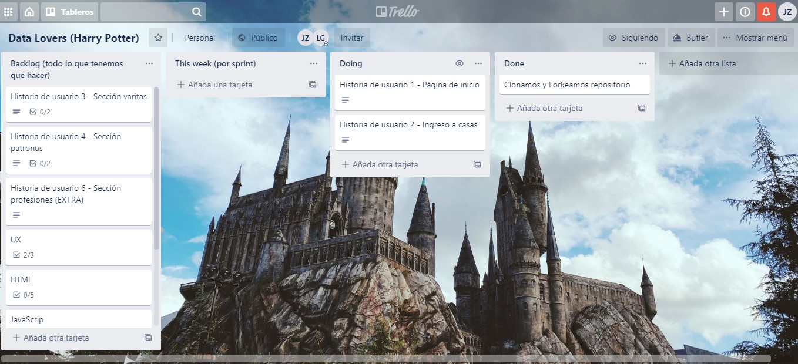
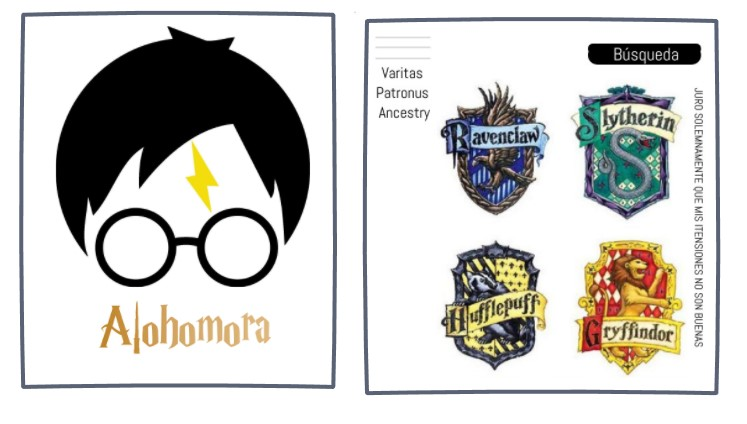
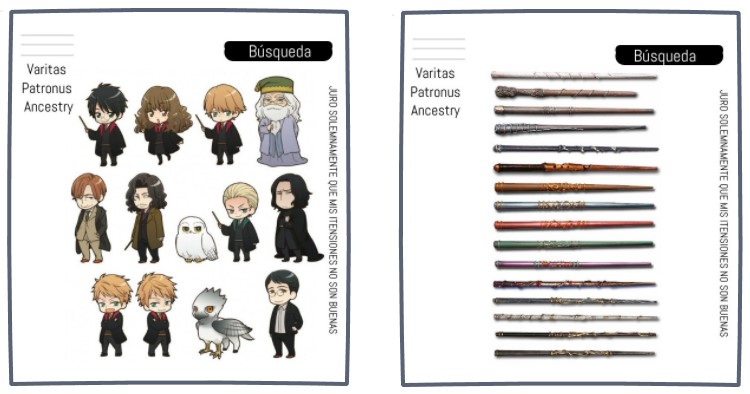
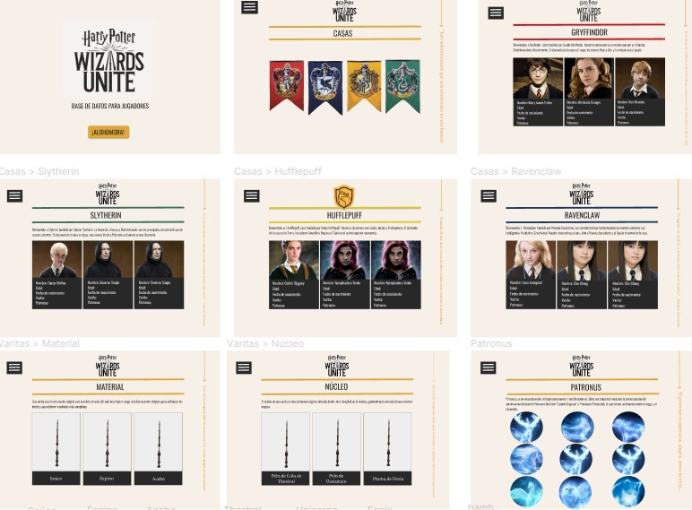

# Harry Potter Wizards Unite

# 1. Descripción del Proyecto

"Harry Potter Magic" es una app que le permite adentrarse al mundo y las aventuras del joven aprendiz de magia y hechicería Harry Potter. A trevés de la aplicación podra conocer datos importantes que le ayudaran a jugar "Harry Potter: Wizards Unite" y a vencer cada uno de los obstaculos que se le presenten.

En "Harry Potter XXXXX" conocera todo acerca de:

- Casas de Hogarwts
- Personajes
- Varitas
- Patronus
- Profesiones

# 2. Definición de Usuario

Harry Potter Magic esta dirigido a personas que conocen el personaje "Harry Potter", los libros y peliculas pero no esta familiarizado con el juego de realidad aumentada "Harry Potter: Wizards Unite".

# 3. Historias de Usuario

HISTORIA 1 : Crear una pagina inicial con botón de ingreso llamado "Alohomora"

HISTORIA 2 : Ingreso a la aplicación, ver las casas y elegir, arrojara una lista de los personajes que pertenecen a esa casa. Además, ordenar de forma ascendente o descendente según el nombre del personaje.

HISTORIA 3 : Crear una sección llamada "Varitas" que contendra dos opciones "Material y Núcleo".

HISTORIA 4: Opción 'Material" se detallara el material del cual están hechas las varitas de los personajes.

HISTORIA 5: Opción "Núcleo" mostrara el núcleo que posee cada varita.

HISTORIA 6 : Crar una sección llamada "Patronus", en ella se detallara los patronus de cada uno de los personajes.

# 4. Planificación de Proyecto

# 5. Prototipos

- Baja Fidelidad Desktop

- Alta Fidelidad Desktop

# 5. Test de Usabilidad: Testimonios

Testeamos nuestro prototipo inicial de Alta Fidelidad en un total de 8 personas, la intención era conocer sus impresiones y sugerencias acerca de nuestra app.

Estas fueron algunas de las respuestas obtenidas durante este proceso:

- Nombre: Melany
- Usuario: Ha jugado Wizard’s Unite.
- Feedback: le gusta la estructura del sitio, lo encuentra informativo, siente que falta información para ser útil para los jugadores. Siente que los títulos deberían estar mejor centrados y que la fuente de las frases laterales es muy pequeña en ambas versiones. Dice que el menú de Profesiones no funciona.

- Nombre: Carolina
- Tipo de usuario: No ha jugado Wizard’s Unite, pero le gusta Harry Potter y es UX
- Feedback: le parece cómoda la estructura del sitio, en un principio no entendía la elección de los colores, pero cuando supo que era por el sitio web oficial, los encontró adecuados. Dice que hay problemas con el menú y que la frase del lateral es demasiado pequeña.

- Nombre: Abraham
- Tipo de usuario: No ha jugado Wizard’s Unite, pero le gusta Harry Potter.
- Feedback: El menú le parecio pequeño, no podia manejar bien cada pestaña. No comprendio bien el objetivo de la app, sugirio aclarar mejor el funcionamiento para que los usruarios se les haga mas facil usarla.

- Nombre: Alejandra
  -Tipo de usuario: Conoce el juego Wizard’s Unite pero no lo ha jugado, le gusta Harry Potter, ha leido los libros y visto las peliculas.
- Feedback: indico que la imagen inicial tardaba mucho en cargar. Sugirio entregar algún tipo de dirección al usuario menos intuitivo para que se le haga mas facil navegar por la app, ademas de agregar una sección de tips.
